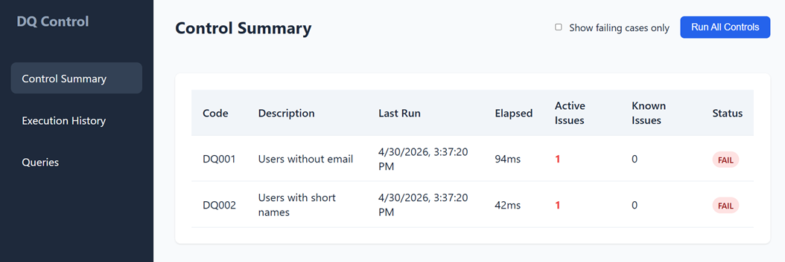
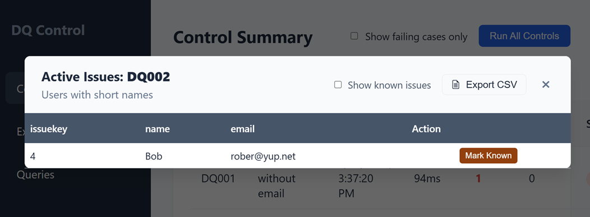
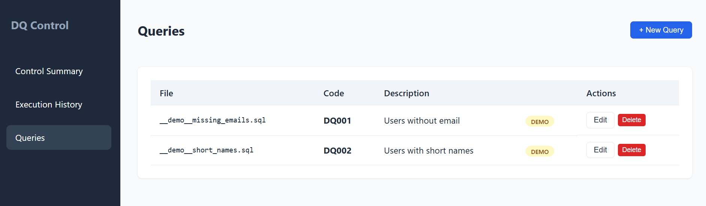
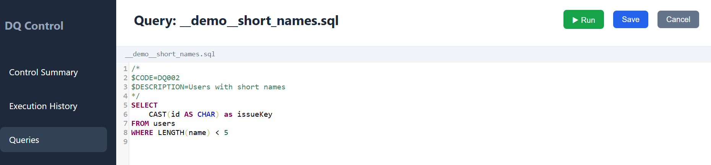
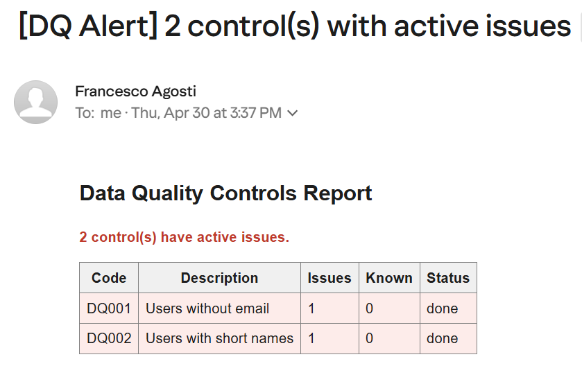

# Dashboard Guide

The SimpleDQC dashboard provides a centralized interface to monitor data quality, manage controls, and handle persistent exceptions.

---

## 1. Control Summary
The **Control Summary** is the default view. It provides a high-level overview of the current status of all data quality controls.

- **Status Overview**: Quickly see which controls are passing, failing (`FAIL`), or encountering errors.
- **Key Metrics**:
    - **Active Issues**: The number of current records failing the business rule.
    - **Known Issues**: Exceptions that have been acknowledged and "muted."
- **Execution Metadata**: Displays the timestamp of the last run and the elapsed time.
- **Filtering**: Use the "Show failing cases only" toggle to focus on active problems.
- **Run Controls**: The "Run All Controls" button triggers a fresh execution of all SQL queries.

---

## 2. Managing Issues (Drill-down)
Clicking on any control row in the Summary opens the **Issues Modal**.

- **Detailed Inspection**: View all raw records returned by the SQL query.
- **Exporting**: Click **"Export CSV"** to download the list for further analysis or reporting.
- **Handling Known Issues**: 
    - Click **"Mark Known"** on a specific `issueKey` to suppress it from future alerts.
    - Toggle **"Show known issues"** to see previously muted exceptions (highlighted in the list).

---

## 3. Queries Management
The **Queries** view lists all available SQL control files.

- **File Management**: View filenames, associated control codes, and descriptions.
- **Demo Content**: Files provided as examples are clearly marked with a `DEMO` badge.
- **Actions**:
    - **Edit/View**: Open the SQL editor for a specific control.
    - **Delete**: Remove a control file from the system.
    - **+ New Query**: Create a new control from scratch.

---

## 4. SQL Editor
The built-in editor allows you to develop and test controls in real-time.

- **Metadata Tags**: Use `$CODE=` and `$DESCRIPTION=` comments to define control properties.
- **Live Run**: Use the **"Run"** button to execute the query against the source database and preview results without saving.
- **Save/Cancel**: Instantly deploy changes to the `controls/` folder.

---

## 5. Email Alerts
When controls are executed (either via the dashboard or a scheduler), SimpleDQC sends an automated report if issues are found.

- **Summary Table**: Lists all executed controls, issue counts, and final status.
- **Actionable Data**: Quickly identify which areas need attention from your inbox.

---

## 6. Execution History
The **Execution History** view provides a chronological log of every control run, ensuring full traceability of your data quality over time.

- **Status Tracking**: Monitor transitions from `error` to `done`.
- **Performance Monitoring**: Track `elapsed` time to identify slow-running queries.
